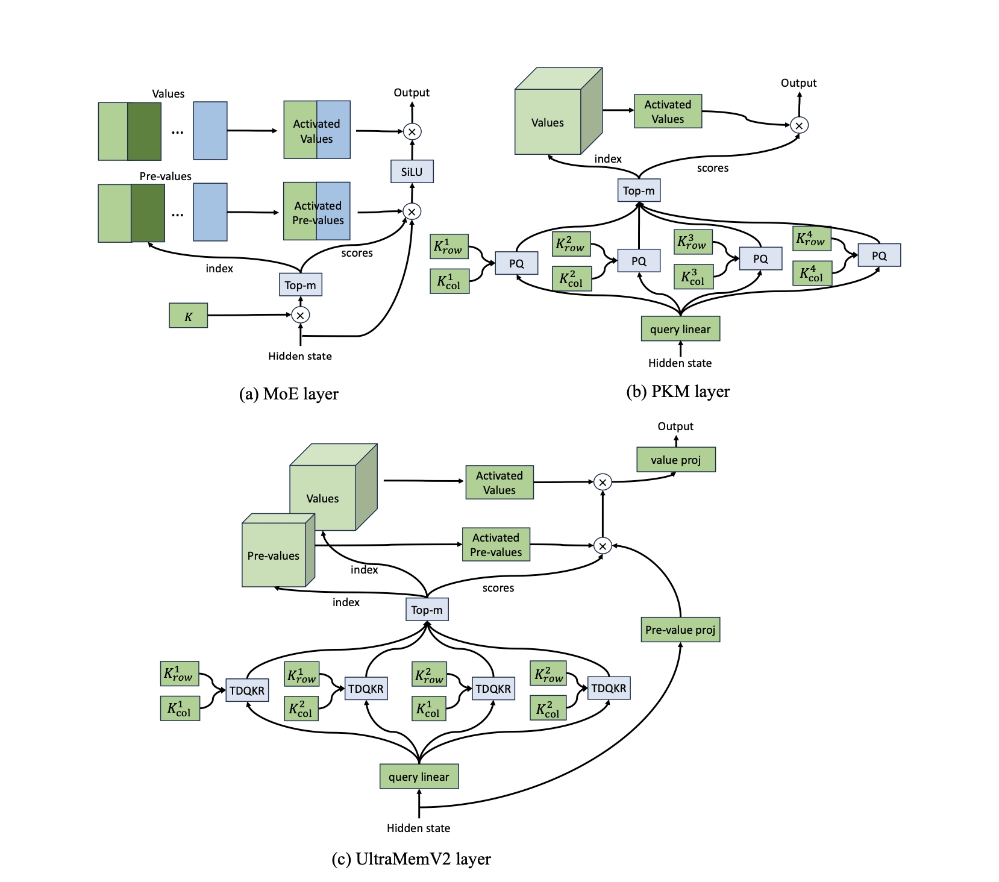
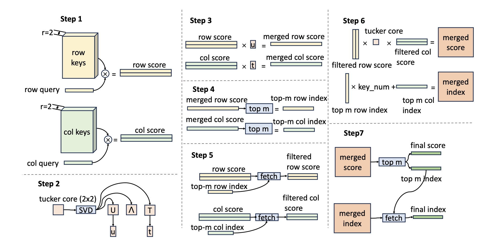
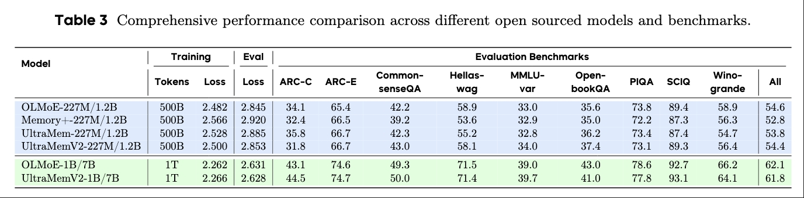

<div align="center">
  <h1>Ultra Sparse Memory Network</h1>
</div>
<p align="center">
  <a href="https://github.com/allenai/OLMo/blob/main/LICENSE">
    
  </a>
  <a href="https://arxiv.org/pdf/2411.12364">
    
  </a>
</p>


Ultra sparse memory network (UltraMem) is a sparse model similar with MoE, but with significantly low memory access, so the inference is fast. but UltraMem have only matched the performance of 2-expert MoE models, falling significantly short
of state-of-the-art 8-expert configurations. We present UltraMemV2, a redesigned memory-layer architecture that closes this performance gap.

<figure style="text-align: center;">

<figcaption>Overall structure of 3 sparse layers</figcaption>
</figure>

<figure style="text-align: center;">

<figcaption>Flow of Tucker Decomposed Query-Key Retrieval(TDQKR)</figcaption>
</figure>

<figure style="text-align: center;">

<figcaption>Comprehensive performance comparison across different open sourced models and benchmarks</figcaption>
</figure>


## Installation

Please follow OLMoE https://github.com/allenai/OLMoE

## Training
**Key files**

```
olmo/
├── models.py                    # main model
├── memory_plus_layer.py         # Memory+ layer (by meta)
├── ultramem_layer.py            # UltraMem layer
└── ultramem_layer_v2.py         # UltraMemV2 layer
```
**Dataset**

We use the same dataset as OLMoE. You can download it from [here](https://huggingface.co/datasets/allenai/OLMoE-mix-0924). Then you need use the following command to change the dataset to the format that our model can use:
```
dolma tokens \
--documents ${PATH_TO_DOWNLOADED_DATA} \
--destination ${PATH_WHERE_TO_SAVE_TOKENIZED_DATA} \
--tokenizer.name_or_path 'allenai/gpt-neox-olmo-dolma-v1_5' \
--max_size '2_147_483_648' \
--seed 0 \
--tokenizer.eos_token_id 50279 \
--tokenizer.pad_token_id 1 \
--processes ${NUMBER_OF_CPU_CORES_TO_USE}
```

**Training**

You can run the training script below, which is a 227M/1.2B UltraMemV2. Noticed that we only implement DDP with fused kernel, it's easy to extend to megatron with some synchronization and communication.
```
sh launch.sh ${CONFIG_PATH} \
--save_folder=${SAVE_DIR} \
--run_name=${run_name} \
--save_overwrite=true \
--mount_common_hdfs=true \
--fsdp.sharding_strategy=NO_SHARD \
--canceled_check_interval=9999999 \
--global_indices_file=${CODE_DIR}/global_indices.npy \
--load_path=${CUR_CKPT_PATH} \
--model.init_std=0.02282177322938192 \
--model.init_fn="full_megatron" \
--model.d_model=768 \
--model.n_layers=20 \
--model.n_heads=12 \
--model.n_kv_heads=12 \
--model.weight_tying=true \
--max_duration=5e11T \
--scheduler.t_warmup=1e10 \
--scheduler.t_max=5e11 \
--device_train_microbatch_size=3 \
--global_train_batch_size=768 \
--save_interval=1000 \
--eval_interval=1000 \
--save_num_checkpoints_to_keep=-1 \
--console_log_interval=10 \
\
--model.block_type='sequential' \
--model.mlp_hidden_size=4992 \
\
--optimizer.mem_value_lr_times=4.0 \
--optimizer.mem_value_lr_max_steps_rate=1.0 \
--model.mem_insert_way='full' \
--model.mem_knum=360 \
--model.mem_kdim=192 \
--model.mem_vdim=192 \
--model.mem_pre_vdim=192 \
--model.mem_knn=32 \
--model.mem_head=1 \
--model.mem_share_ratio=0.5 \
--model.mem_type='ultramem_v2' \
--model.mem_value_expand_time=1 \
\
--distributed_strategy=ddp \
--model.init_device='cuda' \
--optimizer.metrics_log_interval=50 \
--model.mem_log_interval=50 \
--save_interval_unsharded=1000
```
You can also pick the code to your own project, it should be easy to run : ）
## Citing
If you find this work helpful or use it in your research, please consider citing our paper:
```bibtex
@article{huang2024ultra,
  title={Ultra-Sparse Memory Network},
  author={Huang, Zihao and Min, Qiyang and Huang, Hongzhi and Zhu, Defa and Zeng, Yutao and Guo, Ran and Zhou, Xun},
  journal={ICLR 2025},
  year={2024}
}
```
## Acknowledgement
Our open-soursed work is mainly based on OLMoE, thanks for their work.
